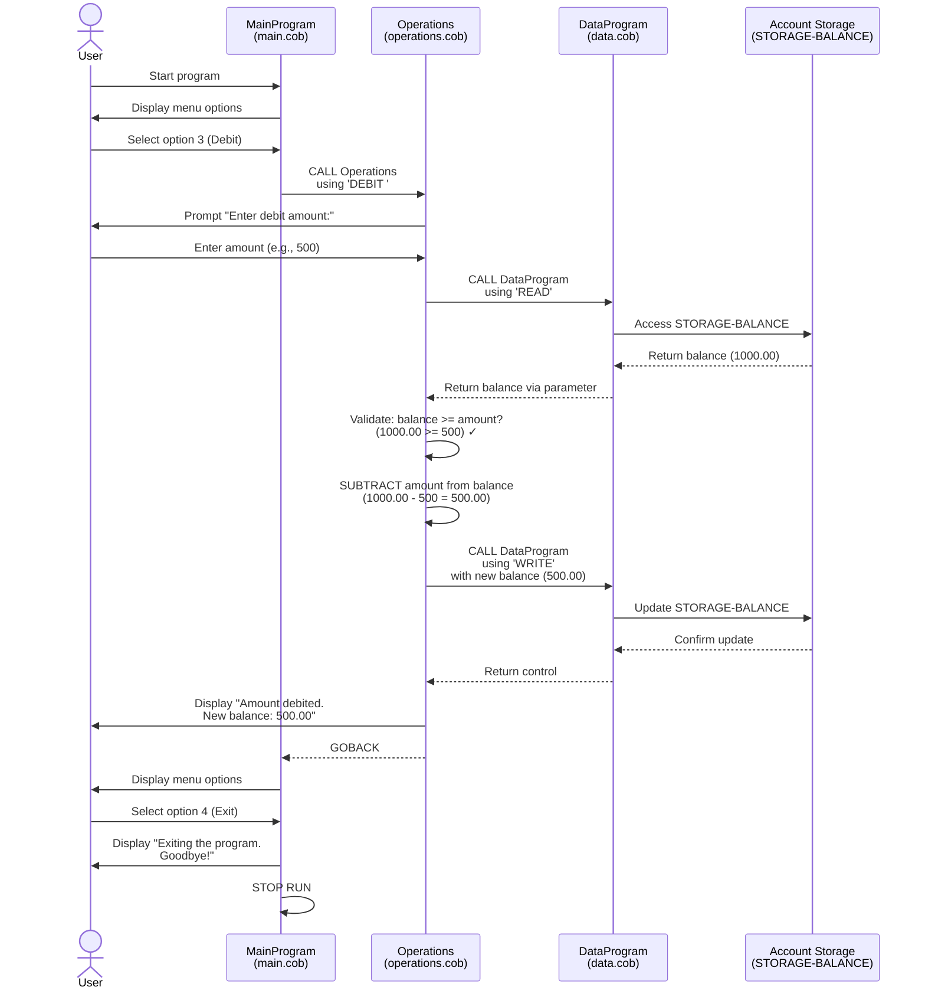
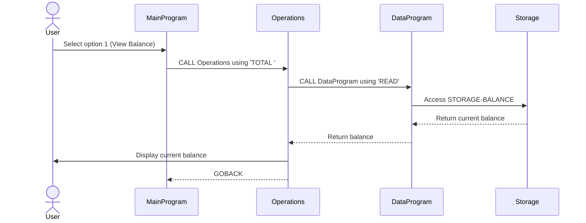
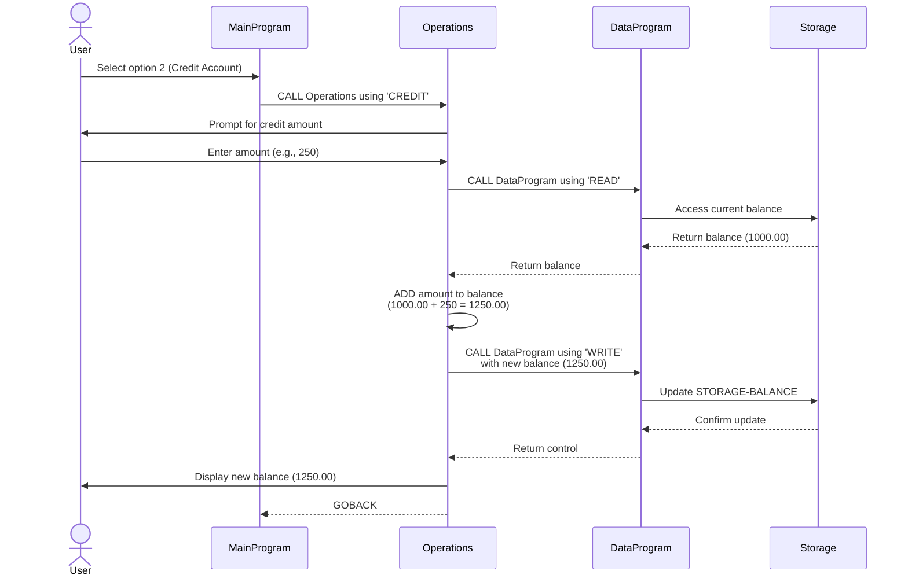
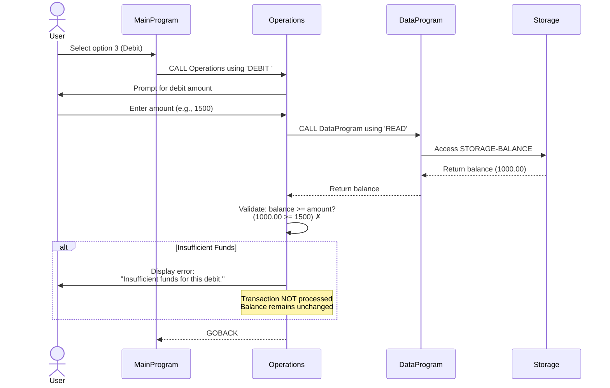

# Student Account Management System - COBOL Documentation

## Overview

This legacy COBOL system implements a student account management application that handles financial transactions on student accounts. The system provides a menu-driven interface for viewing balances, crediting accounts, and debiting accounts with built-in validation for insufficient funds.

---

## COBOL Files

### 1. main.cob (MainProgram)

**Purpose:**
Entry point and user interface controller for the Account Management System. This program presents a menu-driven interface that allows users to select operations and controls the flow of the application.

**Key Functions:**
- **Menu Display**: Displays a main menu with four options
- **User Input Processing**: Accepts user choice (1-4) from console
- **Operation Routing**: Routes user selections to the Operations module using CALL statements
- **Session Management**: Maintains a session loop (CONTINUE-FLAG) that terminates when user selects Exit

**Menu Options:**
1. **View Balance** - Displays current account balance
2. **Credit Account** - Adds funds to the student account
3. **Debit Account** - Withdraws funds from the student account
4. **Exit** - Terminates the program

**Program Logic:**
```
- Initialize CONTINUE-FLAG to 'YES'
- Loop while CONTINUE-FLAG ≠ 'NO'
  - Display menu options
  - Accept user choice
  - Evaluate choice:
    - 1 → CALL Operations with 'TOTAL ' parameter
    - 2 → CALL Operations with 'CREDIT' parameter
    - 3 → CALL Operations with 'DEBIT ' parameter
    - 4 → Set CONTINUE-FLAG to 'NO'
    - Other → Display error message
  - End loop
- Display exit message
- STOP RUN
```

**Data Section:**
- `USER-CHOICE`: Single digit (0-9) for menu selection
- `CONTINUE-FLAG`: Three-character string ('YES'/'NO') for session control

---

### 2. data.cob (DataProgram)

**Purpose:**
Data persistence layer that manages the storage and retrieval of student account balances. This module acts as the single source of truth for account balance data and provides read/write operations.

**Key Functions:**
- **Balance Storage**: Maintains persistent account balance (initial value: 1000.00)
- **READ Operation**: Retrieves current balance from storage
- **WRITE Operation**: Updates balance in storage

**Data Storage:**
- `STORAGE-BALANCE`: Account balance stored as numeric value with 6 digits and 2 decimal places (PIC 9(6)V99)
- Initial balance: 1000.00 (representing student account startup credit)

**Operation Types:**
- **'READ'**: Copies STORAGE-BALANCE to the BALANCE parameter passed from caller
- **'WRITE'**: Copies the BALANCE parameter to STORAGE-BALANCE to persist updates

**Program Logic:**
```
LINKAGE SECTION Input:
- PASSED-OPERATION (6-char operation type)
- BALANCE (6-digit numeric value with 2 decimals)

Process:
- If PASSED-OPERATION = 'READ'
  - MOVE STORAGE-BALANCE TO BALANCE
- Else if PASSED-OPERATION = 'WRITE'
  - MOVE BALANCE TO STORAGE-BALANCE
- End if
- GOBACK to caller
```

**Notes:**
- This module is called by the Operations module for all data access
- Encapsulation: Only authorized through READ/WRITE operations

---

### 3. operations.cob (Operations)

**Purpose:**
Business logic layer that implements the three core account operations (View Balance, Credit, Debit). This module enforces business rules and validates transactions.

**Key Functions:**

#### TOTAL (View Balance)
- **Function**: Retrieve and display current account balance
- **Steps**:
  1. CALL DataProgram with 'READ' operation
  2. Display current balance to user
- **Output**: "Current balance: [amount]"

#### CREDIT (Add Funds)
- **Function**: Add specified amount to student account
- **Steps**:
  1. Prompt user for credit amount
  2. Accept amount from input
  3. CALL DataProgram to READ current balance
  4. ADD amount to balance
  5. CALL DataProgram to WRITE updated balance
  6. Display new balance
- **Output**: "Amount credited. New balance: [amount]"
- **No validation**: Credits are accepted without limit (institutional deposit)

#### DEBIT (Withdrawal)
- **Function**: Subtract specified amount from student account with validation
- **Steps**:
  1. Prompt user for debit amount
  2. Accept amount from input
  3. CALL DataProgram to READ current balance
  4. **Validate**: Check if FINAL-BALANCE >= AMOUNT
  5. If valid:
     - SUBTRACT amount from balance
     - CALL DataProgram to WRITE updated balance
     - Display new balance
  6. If insufficient funds:
     - Display error message: "Insufficient funds for this debit."
     - Do NOT process transaction
- **Output** (Success): "Amount debited. New balance: [amount]"
- **Output** (Failure): "Insufficient funds for this debit."

**Data Section:**
- `OPERATION-TYPE`: 6-character operation identifier
- `AMOUNT`: Numeric value for transaction amount (PIC 9(6)V99)
- `FINAL-BALANCE`: Current account balance (PIC 9(6)V99)
- Initial value: 1000.00

---

## Business Rules - Student Accounts

### 1. **Minimum Initial Balance**
- All student accounts start with a balance of **1,000.00** (institutional credit)

### 2. **Insufficient Funds Protection**
- **Critical Rule**: Debit transactions cannot proceed if the account balance is less than the requested debit amount
- System prevents overdrafts by validating: `FINAL-BALANCE >= AMOUNT`
- Failed transactions are not processed and account balance remains unchanged

### 3. **Credit Operations**
- Credit (deposit) operations have no upper limit
- Any amount can be credited to a student account without validation
- Useful for processing institutional payments, scholarships, or student deposits

### 4. **Debit Operations**
- Debit (withdrawal) operations require sufficient funds
- System enforces balance validation before processing
- Provides financial safeguard to prevent negative account balances

### 5. **Balance Persistence**
- All balance changes are immediately persisted through the DataProgram module
- Each transaction reads current balance, applies operation, and writes back updated balance
- Ensures data consistency across program executions

### 6. **Transaction Types**
- **TOTAL**: Read-only operation (no balance change)
- **CREDIT**: Allows balance increase without restriction
- **DEBIT**: Conditional balance decrease (requires sufficient funds check)

---

## System Architecture

```
┌─────────────────────────────────┐
│       MainProgram (main.cob)    │
│  - User Interface               │
│  - Menu Display & Routing       │
└────────────────┬────────────────┘
                 │ CALL Operations
                 ▼
┌─────────────────────────────────┐
│     Operations (operations.cob)  │
│  - Business Logic               │
│  - Transaction Processing       │
│  - Validation Rules             │
└────────────────┬────────────────┘
                 │ CALL DataProgram
                 ▼
┌─────────────────────────────────┐
│     DataProgram (data.cob)      │
│  - Data Persistence             │
│  - READ/WRITE Operations        │
│  - Balance Storage              │
└─────────────────────────────────┘
```

---

## Data Flow Example: Debit Transaction

```
1. User selects option 3 (Debit) from main menu
   ↓
2. MainProgram CALL Operations using 'DEBIT '
   ↓
3. Operations prompts user: "Enter debit amount: "
   ↓
4. User enters amount (e.g., 500)
   ↓
5. Operations CALL DataProgram using 'READ'
   → Retrieves current balance (1000.00)
   ↓
6. Operations validates: 1000.00 >= 500? YES
   ↓
7. Operations SUBTRACT 500 from balance → 500.00
   ↓
8. Operations CALL DataProgram using 'WRITE'
   → Stores updated balance (500.00)
   ↓
9. Operations displays: "Amount debited. New balance: 500.00"
   ↓
10. Returns to main menu
```

---

## Error Handling

| Scenario | Error Message | Action |
|----------|---------------|--------|
| Invalid menu choice | "Invalid choice, please select 1-4." | Redisplay menu |
| Debit amount > balance | "Insufficient funds for this debit." | Cancel transaction, return to menu |
| Valid CREDIT | Display new balance | Update balance, return to menu |
| Valid DEBIT | Display new balance | Update balance, return to menu |

---

## Data Flow Sequence Diagram

The following Mermaid sequence diagram illustrates the complete data flow when a user performs a debit transaction. This flow represents the interactions between the three main program modules and demonstrates how data moves through the system.



---

## Alternative Data Flows

### View Balance Flow (Option 1)


### Credit Flow (Option 2)


### Failed Debit Flow (Insufficient Funds)


---

## Future Modernization Considerations

1. **Replace COBOL with Modern Language**: Migrate to Java, Python, or Node.js
2. **Database Integration**: Replace in-memory storage with SQL/NoSQL database
3. **API Layer**: Expose operations through RESTful endpoints
4. **Audit Trail**: Add transaction logging and audit capabilities
5. **Admin Dashboard**: Build web interface for account management
6. **Authentication**: Implement user authentication and authorization
7. **Input Validation**: Add comprehensive input validation and error handling
8. **Concurrent Access**: Handle multiple simultaneous user sessions
